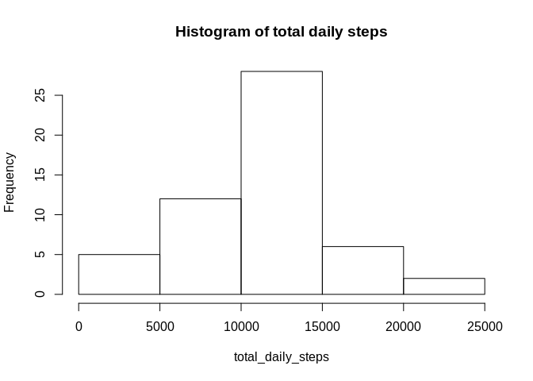
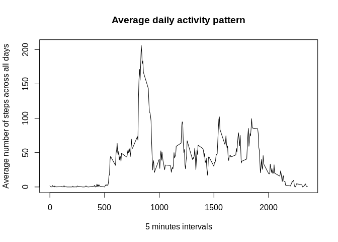
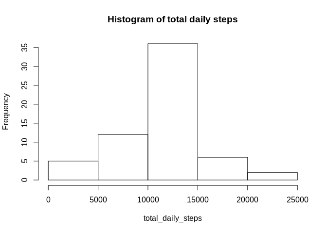
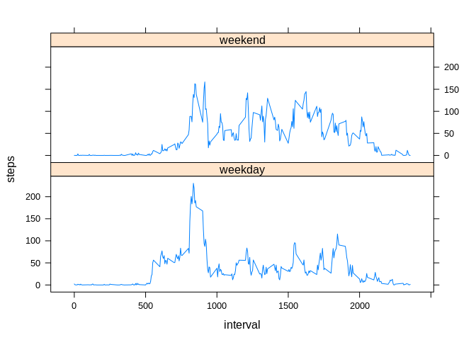

## Loading and preprocessing the data

* Load the data (i.e. `read.csv()`)


```r
if(!file.exists('./data')) dir.create('./data')
unzip(zipfile = 'activity.zip', exdir = './data')
dataset <- read.csv('./data/activity.csv')
summary(dataset)
```

```
##      steps                date          interval     
##  Min.   :  0.00   2012-10-01:  288   Min.   :   0.0  
##  1st Qu.:  0.00   2012-10-02:  288   1st Qu.: 588.8  
##  Median :  0.00   2012-10-03:  288   Median :1177.5  
##  Mean   : 37.38   2012-10-04:  288   Mean   :1177.5  
##  3rd Qu.: 12.00   2012-10-05:  288   3rd Qu.:1766.2  
##  Max.   :806.00   2012-10-06:  288   Max.   :2355.0  
##  NA's   :2304     (Other)   :15840
```

* Process/transform the data (if necessary) into a format suitable for your analysis


```r
interval = as.character(dataset$interval)

g <- function(char){
  c <- paste(paste(rep('0',4-nchar(char)), collapse = ''),char, sep = '')
  d <- paste(substr(c, 1, 2), substr(c, 3, 4), sep = '-')
  return(d)
}

interval <- sapply(interval,g)

date2 <- paste(as.character(dataset$date), interval, sep = '-')

library(lubridate)
```

```
## 
## Attaching package: 'lubridate'
```

```
## The following object is masked from 'package:base':
## 
##     date
```

```r
date2 <- parse_date_time(date2, orders = '%y-%m-%d-%h-%m')
```

```
## Warning: hms, hm and ms usage is deprecated, please use HMS, HM or MS
## instead. Deprecated in version '1.5.6'.
```

```r
dataset$date2 <- date2
```


## What is mean total number of steps taken per day?

* Make a histogram of the total number of steps taken each day

```r
splitted_data <- split(dataset$steps, f = dataset$date)
total_daily_steps <- sapply(X = splitted_data, FUN = sum)
hist(total_daily_steps, main = 'Histogram of total daily steps')
```

<!-- -->

* Calculate and report the **mean** and **median** total number of steps taken per day

The mean and median total number of steps taken daily are 1,0766189\times 10^{4} and 10765 respectively.

## What is the average daily activity pattern?

* Make a time series plot (i.e. `type = "l"`) of the 5-minute interval (x-axis) and the average number of steps taken, averaged across all days (y-axis)


```r
splitted_data <- split(dataset$steps, f = as.factor(dataset$interval))
mean_steps_by_interval <- sapply(X = splitted_data, FUN = mean, na.rm = T)
plot(unique(dataset$interval), mean_steps_by_interval, type = 'l',main = 'Average daily activity pattern', xlab = '5 minutes intervals', ylab = 'Average number of steps across all days')
```

<!-- -->

* Which 5-minute interval, on average across all the days in the dataset, contains the maximum number of steps?

The 5-minute inverval containing maximum number of steps on average across all days is 835 .

## Imputing missing values

* Calculate and report the total number of missing values in the dataset (i.e. the total number of rows with `NA`s)

There are 2304 missing values in the dataset and that corresponds to 13,1147541% of the data.

* Devise a strategy for filling in all of the missing values in the dataset. The strategy does not need to be sophisticated. For example, you could use the mean/median for that day, or the mean for that 5-minute interval, etc.

The NA's will be replaced by the average number of steps of the given interval across all days.

* Create a new dataset that is equal to the original dataset but with the missing data filled in.


```r
dataset2 <- dataset
steps_missing_logical <- is.na(dataset2$steps)
index <- seq_along(steps_missing_logical)

g <- function(x,y){
  if(x %% length(y)) return (x %% length(y))
  else return (length(y))
}

for (i in index){
  if (steps_missing_logical[i]){
    
    dataset2$steps[i] <- mean_steps_by_interval[g(i,mean_steps_by_interval)]
  }
}
```

* Make a histogram of the total number of steps taken each day and Calculate and report the **mean** and **median** total number of steps taken per day. Do these values differ from the estimates from the first part of the assignment? What is the impact of imputing missing data on the estimates of the total daily number of steps?


```r
splitted_data <- split(dataset2$steps, f = dataset$date)
total_daily_steps <- sapply(X = splitted_data, FUN = sum)
hist(total_daily_steps, main = 'Histogram of total daily steps')
```

<!-- -->

```r
splitted_data <- split(dataset$steps, f = as.factor(dataset$interval))
mean_steps_by_interval <- sapply(X = splitted_data, FUN = mean, na.rm = T)
plot(unique(dataset$interval), mean_steps_by_interval, type = 'l',main = 'Average daily activity pattern', xlab = '5 minutes intervals', ylab = 'Average number of steps across all days')
```

<!-- -->

The mean and median total number of steps taken daily are 1,0766189\times 10^{4} and 1,0766189\times 10^{4} respectively.
The histogram differs slightly.


## Are there differences in activity patterns between weekdays and weekends?

* Create a new factor variable in the dataset with two levels -- "weekday" and "weekend" indicating whether a given date is a weekday or weekend day.


```r
isweekend <- wday(dataset2$date2)
weekday_logical <- isweekend %in% 2:6
weekend_logical <- isweekend %in% c(1,7)
isweekend[weekday_logical] <- 'weekday'
isweekend[weekend_logical] <- 'weekend'
isweekend <- as.factor(isweekend)
dataset2$isweekend <- isweekend
```


* Make a panel plot containing a time series plot (i.e. `type = "l"`) of the 5-minute interval (x-axis) and the average number of steps taken, averaged across all weekday days or weekend days (y-axis). The plot should look something like the following, which was created using **simulated data**:


```r
splitted_data <- aggregate(steps ~ interval + isweekend, data = dataset2, mean)
library(lattice)
xyplot(steps~interval|isweekend,data=splitted_data,layout = c(1,2),type="l")
```

<!-- -->
